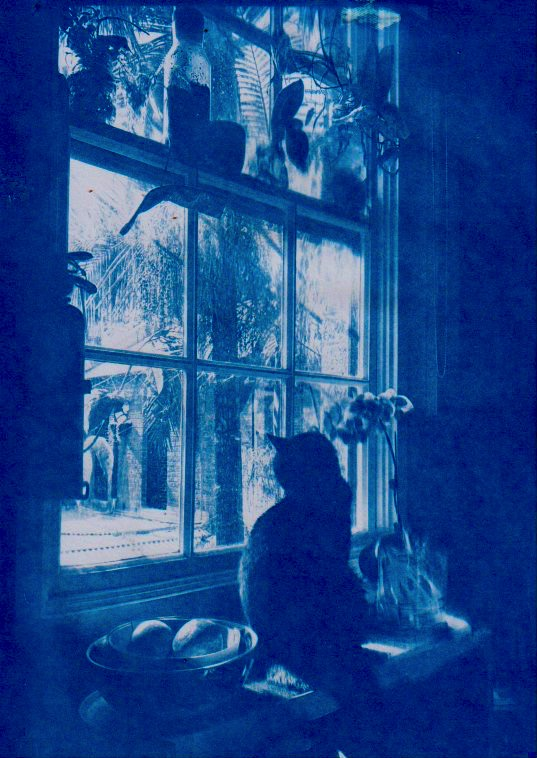
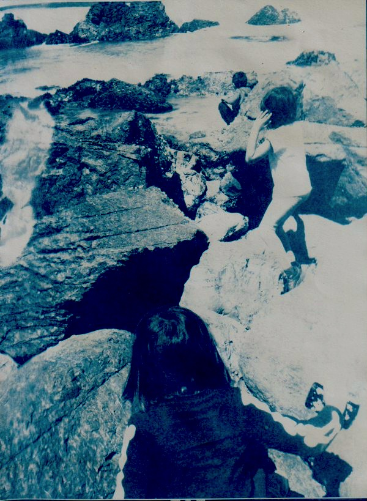
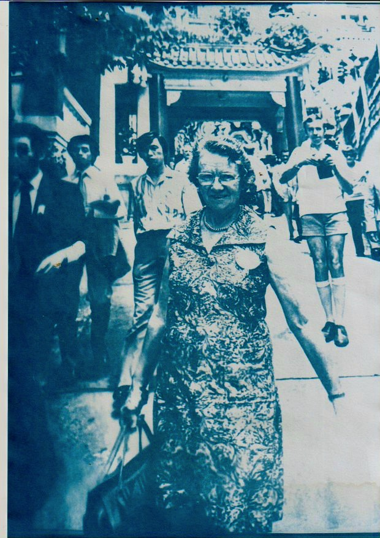

Cyanotype is an old form of processing photographs. Blueprints were originally cyanotypes.

Here's a couple from recently.

This is my cat. You wouldn't know it, but she is an undisputed killer. The reasons for all those 'keep your cat indoors' warnings are ... my cat.

I took this photo about 15 years ago. It's at a small cove just around from Lighthouse Beach at Port Macquarie. We used to live up there and it's really the only place I've ever thought of as 'home'. 

This is my Grandmother, probably in Taiwan or Hong Kong (?). Long before I existed, which makes the photo over 50 years old. It's nice to see her face again.

