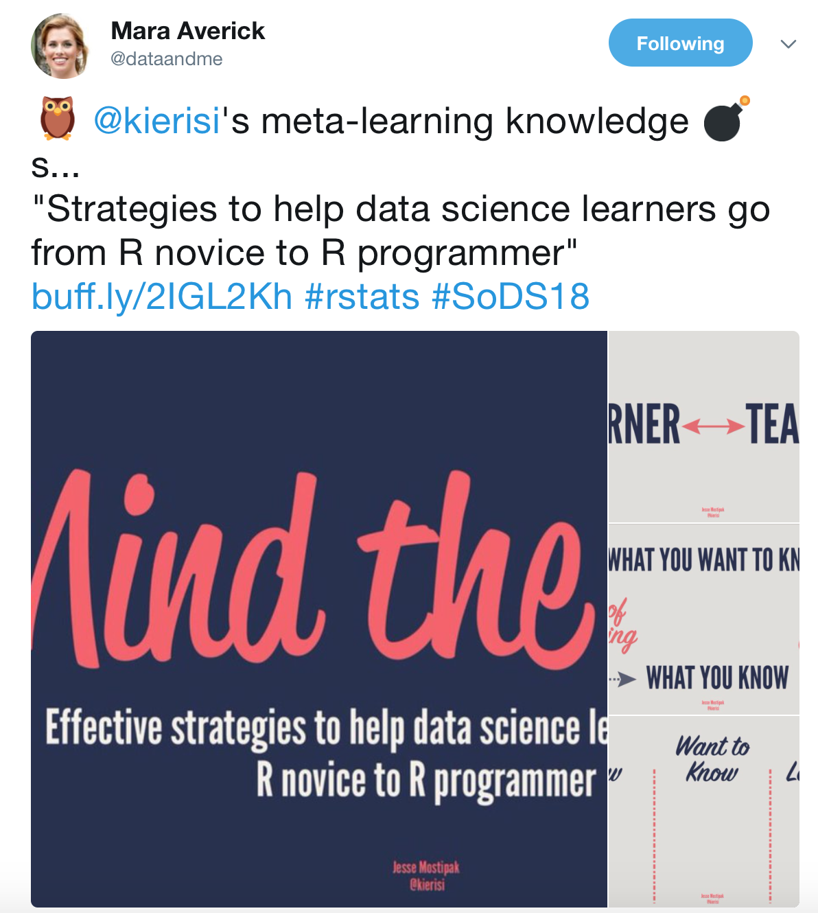
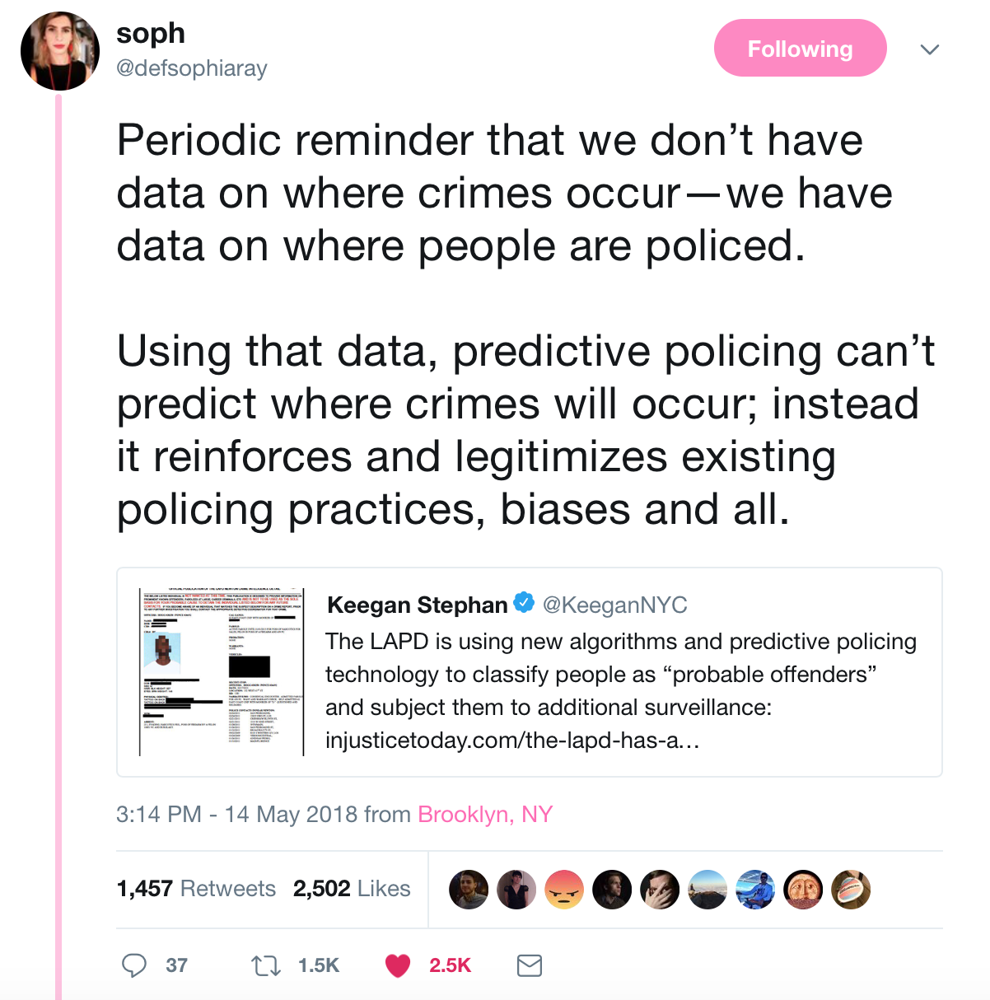

# Introduction

R is a growing, vibrant programming language. Originally created by Ihaka and Gentleman in the 1990s, what was a niche experimental language is now in mainstream usage across many disciplines and domains (Ihaka, 1998).

One thing that Ihaka and Gentleman may not have intended at the time was the fact that R is no longer _just_ a programming language. Users of R are developing into a distinct programming subculture at the intersection of multiple domains. This places it in a unique position, both to benefit from and to influence those domains

This piece argues that not only is R a developing subculture: that being a subculture it can transmit and develop ideas that have a fundamental economic value beyond the coded output it enables. This value generation is a powerful force that helps members of the subculture perform more efficiently and more creatively. 

This piece also argues that not only does R as a subculture engender _value_, it creates, develops and demands _values_. A subculture developing in R does not just develop and transmit _ideas_, it develops and transmits an _ideaology_, one that has the potential to reach well beyond the fields and domains of its userbase.

# Not just a language

R is a programming language with two decades of development. In addition to that programming development, community development has expanded rapidly in recent years. The R community is not bounded by any single institution, group or online platform. While there are large and distinct user groups - online and on the ground: none of these wholly encompass the R community.

These communities, diverse and developing, share commonalities and crossovers that go beyond the programming language itself. They share distinctive patterns of behaviour, beliefs and mores. 

These should not be construed as a wholly _homogeneous_ set of beliefs and behaviours: indeed, there are many differences. R-Ladies has a distinctive difference to the R community on [Stack Overflow](www.stackoverflow.com), for example: even though they share some of the same purpose to promote R usage. These are both different to the #rstats Twitter community and distinctly different to meetups in cities across the world. 

Anheier et al. (2009) notes that subcultures can exist at all levels of organisations. In other words, [xkcd was right, it's fractal all the way down (xkcd, 2018)](https://xkcd.com/1095/). However, these diverse groups share distinctive traits that tie them together. 

If we take the definition of a subculture as per Hodkinson (2012), these distinctive traits are _"...extra-ordinary in their location within the parameters and environment of unusually concentrated and often defiant communities centred on sets of styles and practices which, in some respects, are spectacular and distinctive and are understood as such both by insiders and outsiders."_ 

In the context of R, these are distinctive traits applied by others collectively _("the R community is ...")_ as well as those proudly championed within the community. For example, R's own language quirks, notably the assignment operator, <-.

## Diverse communities, shared features

The developing R subculture has a number of facets of a shared lifeworld that ties these diverse groups together. These include:

__Shared institutions.__ There are a number of institutions that R users regularly share with, participate in or are benefited by. 

These include institutions critical to the functioning of R as a programming language, such as the R Core group, CRAN (Centralised R Archive Network) and the R Foundation. However, participants in the developing subculture are not limited to these institutions: many R users participate in other institutions like R-Ladies, or R for Data Science learning community.

__Distinct and well-developed philosophical concepts__. Many members of the developing subculture grapple with, embrace or dispute with certain philosophies, most notably _'the tidyverse'_. Indeed, there is a substantial differential of opinon within the subculture around the tidyverse, which paralells the experience Coleman (2012) observed among 'hackers' in the Debian project. 

Domain-specific issues, such as the replicability crisis in psychology (see for example Pashler and Wagenmakers, 2012) have created deep ideological discussions and responses from within the R community that transcend the original domain Indeed, one of the most important institutions in the subculture, ROpensci, is predicated on improving the tools available to the subculture to manage reproducibility generally ( [ROpensci, 2018](https://ropensci.org/about/)).

Intellectual constructs like the _layered grammar of graphics_ (Wickham, 2010) or the _grammar of data manipulation_ (Wickham et al., 2017) contribute to overall meta constructs around programming and data agency. 

__Content developed especially for consumption within subculture__. The developing subculture produces more than code for the use of analysts and analysis produced by R code. The developing subculture produces, both for its own consumption and those outside of it:

_Visualisation as art:_ Art created with R alone or in combination with other tools is well-known (see for example [the R Graph Gallery, Holtz (2017)](https://www.r-graph-gallery.com/portfolio/data-art/) or [Flowing Data (Yau, 2018)](http://flowingdata.com)). 

But it can also be produced accidentally and shared for appreciative purposes (see for example [accidental aRT (Woo and Mudrak 2018)](http://accidental-art.tumblr.com)).

_Analysis for entertainment and general education:_ Many analyses produced in R by the subculture are not intended solely for serious scientific or business purposes, they can be intended to educate about tools or techniques, or simply created for the pleasure the maker has in the act of analysis and sharing. Two well-known examples include Robinson's (2016, 2017) [analysis of Trump's tweets](http://varianceexplained.org/r/trump-tweets/) and [Meek and Averick (2017)](https://archervisualization.herokuapp.com) (although the site was built in D3, analysis was also conducted in R). 

_Extensive educative materials and communities:_ The purposes for these materials are varied, but include materials for R, the programming language (see for example Bocek (2018), Maegan (2018) among many others), for the dynamic package sharing system, [such as Silge (2017)](https://juliasilge.com/blog/navigating-packages/) and for navigating the community itself, [such as Ellis (2017)](https://ropensci.org/blog/2017/06/23/community/) as well as many other specific purposes.

_Meta cultural content:_ Created for the purpose of alerting the subculture to resources, developments or other community concerns, examples include [R-Bloggers](https://www.r-bloggers.com), [R Weekly](https://www.rweekly.org), [Rseek](rseek.org) and the R Journal. 

This meta-cultural content need not be formalised. One prominent informal example is Mara Averick's use of the Twitter platform to inform and engage with R users who may not necessarily be a part of a tight-knit R community. 

Averick makes use of informal methods of communication, such as the use of emoji. These signal to readers that the information to be conveyed is accessible. R users often work in fields where the communication of highly technical information can be difficult if users do not have formal training. This technique has been highly successful in spreading content beyond the core subculture (Averick, 2018).

    
A well-developed lifeworld is not unique to R as a developing subculture among programming languages. The seminal work of Coleman (2012) first noted the development of a rich open source subculture within the Debian project. 

We have established an R subculture is developing. Does a distinct developing R subculture matter? If so, what does it _mean_? 

# With subculture comes value

A programming subculture is more than just syntax: it's a confluence of institutions, inputs and a repeatable cycle of output and value generation. The development of this subculture is driving the development of R, the programming language and in reverse the same is true.

A subculture is a powerful means of generating and transmitting information. Subcultures have both formal and informal institutions that generate value and disperse it both within and beyond the subculture. A common R subculture between disciplines helps reduce the intellectual isolation many work under and promotes a marketplace of ideas where good ones get better and great ones move far beyond their initial disciplinary home.

The fact that open source has _value_ is not new, for example, the Debian project and Microsoft's opposition to FOSS (Free Open Source Software). But it is not just the technology being created within the R subculture that is valuable. 

In a subculture, there is an evolutionary tourney of ideas. A subculture absorbs ideas from the outside, sets them to compete with each other, evolves them and generates new ones. Being at the intersection of multiple academic disciplines (statistics, ecology, biology, economics, engineering, computer science, sociology, politics to name a few), schools of thought (e.g. sciences, business, humanities) as well as practioners (academics, students, business, government) means an incredible confluence of ideas absorbed and interacted with. 

A common subculture gives ecologists and economists both a medium and a platform for communication that would not otherwise exist. A world-wide subculture spanning multiple spoken languages gives rise to interactions between users on different continents, both within the same fields and beyond it. Each of these participants brings with them their own perspectives, methodologies and use-cases. These combine to create a whole greater than the sum of its parts.

The value being driven by this tourney of ideas could be considered as three different types:

__Methodological sharing.__ New methodologies (as well as old ones not well known outside their specific fields) are picked up, transmitted and pollinated across new fields with incredible rapidity within this subculture. The sharing of new methodologies both within and without academia increases the value of scientific contributions from academia as well as the value of outputs created beyond these institutions. By making more methodologies available to more practitioners for testing and exploration, the community can create more valuable end-products with better accuracy and usability.

__Ideological sharing.__ Ideologies within the developing subculture are floated, debated, evolve and take root. These can include ideologies around diversity, ethics and robust science (reproducibility amongst others) as well as methodologically specific ones, such a Bayesian concepts. 

__Strategy sharing.__ Shared and devloping concepts around workflows, professionalising software development management techniques, programming norms and statistical/methodological skill contribute to a more robust workforce with a broader outlook, doing better analyses, faster and more productively.

## Prosaic concepts make for real value

A number of these R cultural outputs can translate into a very powerful economic value simply by the productivity increases they engender for a wide group users. They may seem prosaic, but because of the number of people they assist daily, their impacts are substantive now and will be more so in the future. It's also noteworthy that no subculture exists or works in isolation: many of these issues have influenced and been influenced by similar concerns among other programming subcultures.

Without the support of a broader subculture which recognises the power of these ideas, the utilities that have been developed in R would not exist, nor would the wide acceptance of their value that leads to broad uptake have occurred.

Some of the ideas that have been developed and championed in the R community include:

__Visualisation.__ While `ggplot2` owing to Wickham (2009) is possibly the most well known example, the base graphics functionality of R (R Core Team, 2017) helped create a new environment where visualisation was a key factor in the two critical components of creating value through data: the _finding_ and _communication_ of insights. While previous statistical software packages had some plotting functionality, it was often located in different utilities and away from scripted analyses. R provided a significant leap forward in not only the variety and types of plots available for statistical insight and communication: it provided an interface which could be controlled down to a very fine detail. Successive programming iterations from many different developers such as Pederson (2018 among many) and Wilke (2018) have provided significant further utility.

However, the contribution of the subculture does not start and finish with provision of utilities. Critical to the usage of those utilities is the development of modes of usage and educating the developing subculture as to their value. Critical contributions to this field include the work of Cook (see for two examples, Unwin, Hofman and Cook (2013), Cook, Lee and Majumder (2016)), Cairo (2013, 2016 to name a few)  amongst many others. The impact of this was to educate the statistical and datascience communities on both the utility of graphics as a means of finding and communicating insights as well as the many ways in which these can be achieved. 

__Workflow by design.__ While workflows have always existed in some from for any data work, the value of a deliberate, strategically designed flow of work from project inception to completion has not had the wide acceptance in previous years it currently has. Championed by the R community, examples include simple and useful advice, casually applied (a single examplar being [Meager, 2018](https://twitter.com/economeager/status/997077103483981825)) to Bryan's tour de force modernising, deliberately desiging and championing productive, efficient work practices. For a few examples, see Bryan (2017, 2018), Wickham and Bryan (2017), Bryan and Zhao (2017) to name a very few. Other recent contributions include Blischak, Carbonetto and Stephens (2018) and Landau (2018).

The impact of a designed workflow applied widely should not be underestimated. Workflow by design, whatever combination of which the user chooses to employ, empowers the user to take control of the analyses they are conducting: it reduces error, provides for more careful and strategic consideration of the problem at hand, increases productivity and ensures the longevity of the product due to its careful, well documented design.

__Interoperability.__ The R community has long been a champion of the concept of interoperability: the need for R to be able to communicate with other platforms and for R users to be able to access data in many forms. Examples are many and varied, but include recent developments such as [Ursa Labs](http://wesmckinney.com/blog/announcing-ursalabs/) as well as critical packages of long standing such as Rcpp (Eddelbuettel and Francois 2011), rJava (Urbanek, 2016) and newer efforts such as Reticulate (Allaire, Tang and Geelnard 2018) and Tabulizer (Leeper, 2018). These are a few select examples among many critical ones.

The interoperability of R, both its ability to employ and exploit other languages and its ability to query and access different data sources; provides for immense productivity. Highly efficient code can be written combined with other packages and used. Data sources, once trapped in single formats or platforms can now be used far more broadly than ever before.  

__The value of diverse documentation.__ The R community has long championed not just documentation, but diversity of documentation, recognising different learning styles. From vignettes, to videos, talks, blog posts, learning communities and Stack Overflow: the R language is increasingly richly documented and well informed.

The value of diversity of documentation is that it leads to a much broader user base for critical pieces of the infrastructure. This in turn ensures a broader selection of insights and outputs than would have been generated from a narrower user base.
    
These four specific ideas are not the only things that are important within R subculture, but they have had a profound impact on the way we work and will continue to work into the future. They indicate the power to generate value a deep open source community can have.

# With subculture comes _values_

The existence of a developing subculture has the power to create value: both economically and in terms of art, humour and community. However, the confluence of ideas promoted by a developing subculture also brings with it _values_. A subculture transmits not just its _ideas_ but its _ideologies_. As a subculture, we have a shared common set of values. The subculture is also constantly initiating new users into those values as they start to learn and use R. 

Coleman (2012) notes that it is not a monolithic idaology in the hacker subculture exemplified by Debian. Nor is it in R. To quote Coleman,  _"Once we recognise the intimate connection between hacker ethics and liberal commitments *and* the diversity of ethical positions, it is clear that hackers provide less of a unitary and distinguishable ethical position, and more of a mosaic and interconnected, but at times divergent ethical principles."_ 

R as a subculture is dedicated to two broad ideas in particular: data agency, the ability to manipulate data at will, and data literacy, the ability to interpret the information it represents by various means.

We are at a unique place in history as a subculture with a viewpoint focussed on data. The data sciences are a powerful influence on a changing world. The potential of a subculture is that multiple diverging view points about a single development are possible. A subculture is able to provide a robust, nuanced and debated view of new developments.

As a subculture, we are aware of both the _value_ of the new, as well as the need for _values_ to utilise the new fairly. This is particularly critical in light of the rapid development of AI technologies in or culture at large. For example, the Google Voice Assistant's demonstration raised both admiration for the technical skill and productivity potential it displayed, as well as concerns [about the ethics of a human-sounding bot (The Straits Times, 2018)](https://www.straitstimes.com/world/united-states/human-sounding-google-assistant-sparks-ethics-questions). Both are valid reactions to the technological development: there is value in the technical creation, but our values around our interaction with it are still _developing_. A highly technically literate subculture can grapple with both of these points, helping to inform a greater super culture.

Other ethical concerns of great import for the R subculture and the super culture beyond it include the rise of algorithmic decision making and its possible consequences. See for example [McQuillan (2018)](http://journals.sagepub.com/doi/full/10.1177/2056305118768303#articleShareContainer) and [Kehl, Guo and Kessler (2017)](https://dash.harvard.edu/handle/1/33746041).

The phenomenon of a subculture influencing a broader general culture in which it exists was well documented among the Debian hackers by Coleman. She noted,  _"By turning Linux and open source into household names, many more people learned about not just open source but also the ethical foundations—sharing, freedom, and collaboration—of free software production."_ The Debian subculture directly participated in transitioning the view of open source software from unvaluable, unethical, unimportant, to the vibrant, essential and ethically bound technology it's considered today.

R as a subculture has the potential to do something similar in the future. We are at a crossroads where algorithmic decision making, data-driven automation and AI are all a part of our near futures. A strong subculture debates new advances, sees the economic value in them and develops an ethical framework to demand that that this value be distributed fairly, while ensuring the costs are not borne unfairly by a minority.

Ethical explorations are active in the R community. These include projects developed with the assistance of the ROpenSci foundation [such as that owing to Bailey (2018)](https://github.com/dynamicwebpaige/runconf18), and those created by individuals under their own ethical imperatives, such as those owing to Keyes ( [2016](https://ironholds.org/scientific-consent/) and [2017](https://ironholds.org/names-gender/)). [Keyes (2017b)](https://ironholds.org/not-about-image/) also explores how community management can create (or fail to create) an environment of diversity and inclusion: this has direct ethical implications for a community at large.

The R community does not develop its ethics in isolation from the broader programming or the data sciences communities. The community is also exploring confluences of consequences through online media such as Twitter. In one such example, Thompson and Nemeth (2018), neither of whom appear to be R programmers, explored unintended ethical consequences in a post widely shared among data science communities, shown below.

](./images/code_to_kill.jpeg)

In another widely shared example, Python user `@defsophiaray` (Soph, 2018), [noted the often unacknowledged biases of data collection and its unintended consequences on predictive algorithms](https://twitter.com/defsophiaray/status/996151795629125633), shown below. The issues of data-based policing are particularly pertinent world wide, see for example, [The Economist's](https://www.economist.com/news/britain/21742151-over-third-those-named-it-have-no-serious-convictions-database-suspected-london?frsc=dg%7Ce) coverage of British gang activity databases (The Economist, 2018).

These highly visible ethical explorations reinforce existing ethical norms within the R subculture, help develop new ones and educate new members of the developing subculture about the expectations of the community.

R as a subculture creates _value_, but it also receives, develops and ultimately transmits its _values_. There are some values that have taken root in this developing subculture and are points of pride for many within the community:

__Open source:__ As an open source programming language, the ethics of open source are 'built in' to the developing subculture. Many see contribution to open source development of R as part of their involvement with the subculture. They believe in creating new utilities for others to use and build on freely. CRAN is the most visible of the institutions supporting these values, but there are many others.

__Diversity and inclusion:__ There is a developing awareness in the R community that not all members of the subculture have equal access to the meritocracy the community believes in. Many programs and organisations have stepped up to begin the work of changing this, notably R-Ladies and R-Forwards, amongst others. Many in the R community see their role in the community to be encouraging and welcoming to new users. Some go further and create diverse resources or host community events (online or otherwise) to support this aim.

__Reproducibility.__ Originally a question of ensuring scientific contributions are accountable and testable, the importance of reproducibility now has much wider acceptance outside science and in the analytics community at large. Suppported by ROpenSci's purpose of creating tools for reproducible science, the concept has also been championed by Leek (2017, 2018) and Leek and Peng (2015), amongst others.

The potential of the R community to influence a broader superculture has a precedent. In the case of Debian, Coleman (2012) notes that _"Over ten years of active development and use of free software, a critical mass of hackers had inculcated not simply a commitment to their craft but also a well-developed ethos for information freedom and sharing..."_ In R's case, it is possible that community commitment to these and other values may have similar effects at large.

The R community is a group of individuals collectively identifying as part of a whole. Each one contributes his, her or their values to the collective. This is the case whether the decision is made consciously and followed up by action or if no conscious thought is given to values individually or collectively. 

When conscious thought around values is missing, it is not the presence of an absence of values, rather an absence of the presence of thought for them. We should choose our values and champion them, or as Thompson and Nemeth (2018) observed, they may be chosen for us. These values need not and should not be monolithic: the tourney of ideas within the subculture supports ethics as a dynamic concept, changing in response to a changing world.

Members of the subculture take their values with them into their workplaces and use them to make judgement decisions about the work they are doing. They are in turn influenced by the ethics in their workplaces and bring these back to the R community. This has the potential to create powerful change in the culture at large.

# Beyond syntax, conclusion

The R programming language has a vibrant, developing subculture attached to it. This subculture creates not just programming utilities, but art, educational artefacts, communities and research across many domains and fields. The subculture has championed ideas that have had a profound and valuable impact on the development of a modern analytics practice, namely visualisation, workflow, documentation and interoperability.

The presence of a subculture allows ideas to be inherited from other subcultures, altered, debated and built upon in a kind of ideaological evolutionary tourney. This goes beyond content created and into ideology and values. As a community focussed on data agency and literacy, the developing subculture has the potential to be highly influential in the super culture in which it exists, being able to provide a nuanced, robust and multifaceted view of new technological developments.

# References

--- (2018): "A database of suspected London gangsters has been widely shared", _The Economist_, 18/05/10, <https://www.economist.com/news/britain/21742151-over-third-those-named-it-have-no-serious-convictions-database-suspected-london?frsc=dg%7Ce>, accessed 18/05/23.

--- (2018): "Human-sounding Google Assistant sparks ethics questions", _The Straits Times_, 18/05/10, <https://www.straitstimes.com/world/united-states/human-sounding-google-assistant-sparks-ethics-questions>, accessed 18/05/31.

Allaire, J.J., Tang, Y., Geelnard, M., 2018: _Reticulate: Interface to 'Python'_,  R package version 1.5, <https://CRAN.R-project.org/package=reticulate>.

Anheier, Helmut K., Stefan Toepler and Regina List, eds., (2010): _International Encyclopedia of Civil Society_, Springer New York.

Averick, M. (2018): _Twitter Post_, <https://twitter.com/dataandme/status/999834698997170178>, accessed 18/05/27.

Averick, M. and Meeks, E., (2017): _Beyond the Tip: A data-driven exploration of Archer_, <https://archervisualization.herokuapp.com>, accessed 18/05/21.

Bailey, P. (2018): _Ethical Machine Learning: A vignette designed to assist with spotting and preventing proxy bias_, <https://github.com/dynamicwebpaige/runconf18>, accessed 18/05/23.

Blischak, J., Carbonetto, P., Stephens, M. (2018): _workflowr: A Framework for Reproducible and Collaborative Data Science_, R package version 1.0.1, <https://CRAN.R-project.org/package=workflowr>, accessed 18/05/31.

Bocek, M., (2018): _Data Science Course in a Box_, <https://github.com/rstudio-education/datascience-box>, accessed 18/05/21.

Brace, A., (2018): "GGPlot disaster/masterpiece/album cover!", _Accidental ARt_, <http://accidental-art.tumblr.com/image/166785763056>, accessed 18/05/31.

Bryan, J., (2017): _Stat 545_, <https://github.com/STAT545-UBC>, acessed 18/05/22.

Bryan, J., (2018): _Happy Git and GitHub for the useR_, <http://happygitwithr.com>, accesed 18/05/22.

Bryan, J., Zhao, J., (2017): _googlesheets: Manage Google Spreadsheets from R_, R package version 0.2.2, <https://CRAN.R-project.org/package=googlesheets>.

Cairo, A., (2013): _The Functional Art_, New Riders, Berkley.

Cairo A., (2016): _The Truthful Art_, New Riders, Berkley.

Coleman, E.G., (2012): _Coding Freedom: The Ethics and Aesthetics of Hacking_, Princeton University Press, Princeton.

Cook, D., Lee, E-K., Majumder, M. (2016): "Data visualization and statistical graphics in big data analysis"," _Annual Review of Statistics and Its Application_, Volume 3, p. 133-159, <https://www.annualreviews.org/doi/10.1146/annurev-statistics-041715-033420>, accessed 18/05/22. 

Eddelbuettel, D., Francois, R., (2011). "Rcpp: Seamless R and C++
  Integration", _Journal of Statistical Software_, Volume 40, Number 8, p. 1-18, <http://www.jstatsoft.org/v40/i08/>.

Ellis, S.E., (2017): "Hey! You there! You are welcome here", _ROpenSci_, <https://ropensci.org/blog/2017/06/23/community/>, accessed 18/05/21.

Hodkinson, P., (2012): Beyond Spectacular Specifics in the Study of Youth (Sub)Cultures, _Journal of Youth Studies_, Volume 15, Issue 5. 

Holtz, Y., (2018): _The R Graph Gallery_ <https://www.r-graph-gallery.com>, accessed 18/05/21.

Ihaka, R., (1998): _R: Past and Future History_, <https://www.stat.auckland.ac.nz/~ihaka/downloads/Interface98.pdf>, accessed 18/05/21.

Kehl, D., Guo, P., Kessler, S. (2017): _Algorithms in the Criminal Justice System: Assessing the Use of Risk Assessments in Sentencing_, <https://dash.harvard.edu/handle/1/33746041>, accessed 18/05/31.

Keyes, O. (2016): "Ethics, scientific consent and OKCupid", _Ironholds_, <https://ironholds.org/scientific-consent/>, accessed 18/05/23.

Keyes, O. (2017): "Stop Mapping Names to Gender", _Ironholds_, <https://ironholds.org/names-gender/>, accessed 18/05/23.

Keys, O. (2017b): "Behaviour and Community in Open Science", _Ironholds_, <https://ironholds.org/not-about-image/>, accessed 18/05/23.

Landau, W. (2018): _drake: Data Frames in R for Make_, R package version 5.1.2, <https://CRAN.R-project.org/package=drake>, accessed 18/05/31.

Leek, J., (2017): "Reproducibility and replicability is a glossy science now so watch out for the hype", _Simply Statistics_, <https://simplystatistics.org/2017/03/02/rr-glossy/>, accessed 2018/05/23.

Leek, J., (2018): "The value of re-analysis", _Simply Statistics_, <https://simplystatistics.org/2012/12/18/the-value-of-re-analysis/>, accessed 2018/05/23.

Leek, J., Peng, R.D., (2015): "Opinion: Reproducible research can still be wrong: Adopting a prevention approach", _Proceedings of the National Academy of Sciences of the United States of America_, Volume 112, Number 6, p. 1645-1646, <http://www.pnas.org/content/112/6/1645>, accessed 18/05/23.

Leeper, T., (2018): "Release 'open' data from their PDF prisons using tabulizer", _ROpenSci_, <https://ropensci.org/blog/2017/04/18/tabulizer/>, accessed 18/05/22.

Lin Pedersen, T., (2018): _ggraph: An Implementation of Grammar of Graphics for Graphs and Networks_, <https://CRAN.R-project.org/package=ggraph>, accdsed 18/05/30.

Maegan, J., (2018): _R4DS: the next iteration_, <https://www.jessemaegan.com/post/r4ds-the-next-iteration/>, acccessed 18/05/21.

McKinney, W., (2018): _Announcing Ursa Labs: an innovation lab for open source data science_, <http://wesmckinney.com/blog/announcing-ursalabs/>, accessed 18/05/22.

McQuillan, D., (2018): "People’s Councils for Ethical Machine Learning", _Social Media + Society_, published May 2, 2018, <http://journals.sagepub.com/doi/full/10.1177/2056305118768303#articleShareContainer>, accessed 18/05/31.

Meager, R., (2018): _Twitter post_, <https://twitter.com/economeager/status/997077103483981825>, accessed 18/05/22.

Pashler, H., Wagenmakers, E-J., (2012): "Editors’ Introduction to the Special Section on Replicability in Psychological Science: A Crisis of Confidence?", _Perspectives on Psychological Science_, Volume 7, Issue 6, <http://journals.sagepub.com/doi/10.1177/1745691612465253>, accessed 18/05/27.

R Core Team, (2017): _R: A Language and Environment for Statistical Computing_, R Foundation for Statistical Computing, Vienna.

Robinson, D., (2016): "Text analysis of Trump's tweets confirms he writes only the (angrier) Android half", _Variance Explained_, <http://varianceexplained.org/r/trump-tweets/>, accessed 18/05/21.

Robinson, D., (2017): "Trump's Android and iPhone tweets, one year later", _Variance Explained_, <http://varianceexplained.org/r/trump-followup/>, accessed 18/05/21.

ROpensci (2018): "Our Vision and Mission", _ROpenSci_, <https://ropensci.org/about/>, accessed 18/05/27.

Silge, J., (2017): _Navigating the R Package Universe_, <https://juliasilge.com/blog/navigating-packages/>, acccessed 18/05/21.

Soph (2018): _Twitter status_, <https://twitter.com/defsophiaray/status/996151795629125633>, accessed 18/05/23.

Thompson, C., Nemeth, S. (2018): _I Built Software to Kill People_, <https://twitter.com/stephaniecodes/status/992419444810010625>, accessed 18/05/23.

Unwin, A., Hofmann, H., Cook, D., (2013): Let graphics tell the story - datasets in R, _The R Journal_, Volume 5, Issue 1, p. 117-129. <https://journal.r-project.org/archive/2013/RJ-2013-012/RJ-2013-012.pdf>, accessed 18/05/22.

Urbanek, S., (2016): _rJava: Low-Level R to Java Interface_, R package
  version 0.9-8, <https://CRAN.R-project.org/package=rJava>.

Wickham, H., (2009): _ggplot2: Elegant Graphics for Data Analysis_, Springer-Verlag New York.

Wickham, H., (2010): "A Layered Grammar of Graphics", _Journal of Computational and Graphical Statistics_, Volume 19, Number 1, p. 3 - 28.

Wickham, H., Bryan, J., (2017): _readxl: Read Excel Files_, R package version 1.0.0, <https://CRAN.R-project.org/package=readxl>.

Wickham, H., Francois, R., Henry, L., Müller, K. (2017): _dplyr: A Grammar of Data Manipulation_, R package version 0.7.4, <https://CRAN.R-project.org/package=dplyr>.

Wilke, C., (2017): _cowplot: Streamlined Plot Theme and Plot Annotations for 'ggplot2'_, R package version 0.9.2, <https://CRAN.R-project.org/package=cowplot>, accessed 18/05/30.

Woo, K., Mudrak, E., _Accidental aRt_, <http://accidental-art.tumblr.com>, accessed 18/05/21.

Yau, N., (2018): _Flowing Data_, <http://flowingdata.com>, accessed 18/05/21.

Yau, N., (2018b): "Career Paths", _Flowing Data_, <http://flowingdata.com/2017/11/28/career-paths/>, accessed 18/05/31.

